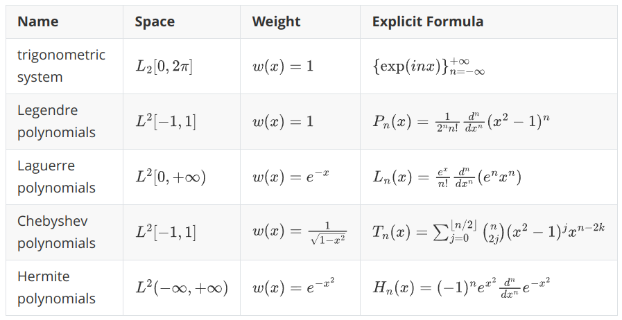
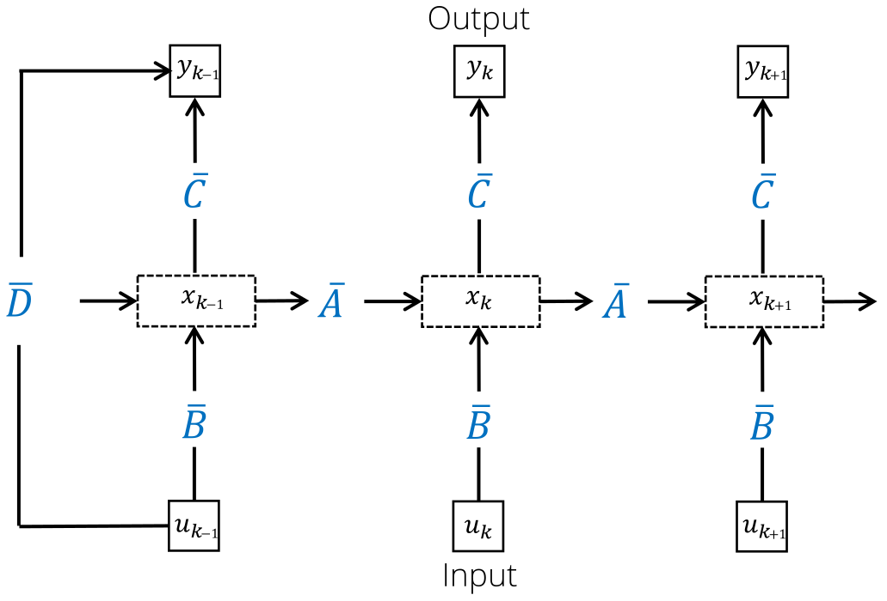
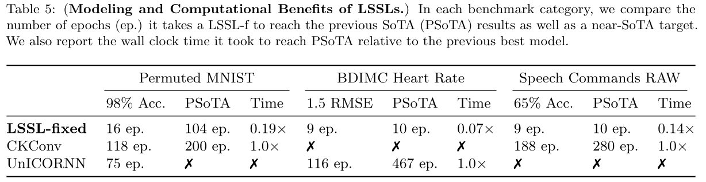
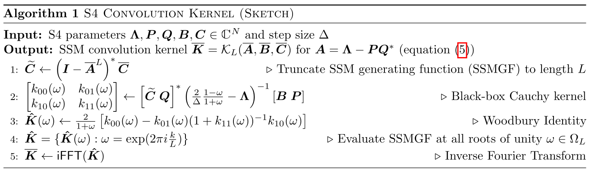

# State-Space Models: От HiPPO к Mamba

## Аннотация

Данная лекция представляет всесторонний обзор State-Space Models (SSMs), прослеживая их эволюцию от основополагающего фреймворка HiPPO до современной архитектуры Mamba. Мы начинаем с математических основ: полиномиальных проекций и дифференциальных уравнений; затем исследуем, как эти концепции были адаптированы в эффективные архитектуры для моделирования последовательностей. Лекция охватывает три основных развития: рекуррентную память HiPPO с оптимальными полиномиальными проекциями, переход к структурированным слоям пространства состояний (LSSL, S4, DSS, S4D), и наконец, селективные модели пространства состояний, воплощенные в Mamba. На протяжении всего изложения мы рассматриваем как теоретические основы, так и практические реализации, подчеркивая, как эти модели достигают линейной временной сложности, сохраняя при этом конкурентоспособную производительность с трансформерами на различных задачах моделирования последовательностей.

## Содержание

1. [Математические предпосылки](#математические-предпосылки)
2. [HiPPO: Рекуррентная память с оптимальными полиномиальными проекциями](#hippo-рекуррентная-память-с-оптимальными-полиномиальными-проекциями)
3. [State-Space Models: От теории к практике](#state-space-models-от-теории-к-практике)
4. [Mamba: Селективные пространства состояний](#mamba-селективные-пространства-состояний)
5. [Заключение](#заключение)

---

## Математические предпосылки

Сперва мы вспомним математические основы, которые пригодятся для понимания State-Space Models.

### Разложение по базису в векторных пространствах

Рассмотрим векторное пространство $V(\mathbb{R})$ с базисом $B = \{\vec{b}_1, \ldots, \vec{b}_N\}$. Любой вектор $\vec{a} \in V$ может быть выражен как:

$$\vec{a} = c_1\vec{b}_1 + \ldots + c_N\vec{b}_N$$

где $\vec{c} = (c_1, \ldots, c_N)$ — это вектор координат, представляющий $\vec{a}$ в базисе $B$.

Если базис ортонормированный:
$$\langle \vec{b}_i, \vec{b}_j \rangle = \begin{cases} 1, & i = j \\ 0, & i \neq j \end{cases}$$

то коэффициенты могут быть вычислены как:
$$c_n = \langle \vec{a}, \vec{b}_n \rangle$$

При ортонормированном базисе векторы координат $c$ образуют векторное пространство $\mathbb{R}^N$. Если допустить некоторую нестрогость интерпретации, то с точки зрения машинного обучения это означает, что вектор координат является идеальным признаковым описанием исходного вектора.

### Функциональные пространства и ортонормированные базисы

Те же принципы распространяются на функциональные пространства. Для функций $f, g \in L^2[-1,1]$ мы определяем скалярное произведение как

$$\langle f, g \rangle = \int_{-1}^1 f(x)g(x) w(x) dx,$$

где $w(x)$ — весовая функция. Классическими примерами ортонормированных полиномиальных базисов служат полиномы Лежандра, полиномы Лагера, полиномы Чебышева и полиномы Эрмита.

### Полиномиальные проекции

Отличие пространства Лебега от векторного пространства в предыдущем разделе в том, что базис $L^2$ бесконечный, в то время как базис $V(\mathbb{R})$ конечномерный. Это означает, что идеальное признаковое описание функции будет бесконечномерным вектором. На первый взгляд, это ставит непреодолимое препятствие для практических применений. Однако мы можем воспользоваться аппроксимациями.

Для любой функции $f(x) \in L^2[-1,1]$ и ортонормированного базиса $\{P_n(x)\}_{n=1}^\infty$ справедлива формула оптимальной аппроксимации:

$$f(x) = \sum_{n=1}^\infty c_n P_n(x) \approx \sum_{n=1}^N c_n P_n(x)$$

где коэффициенты:
$$c_n = \langle f(x), P_n(x) \rangle = \int_{-1}^1 f(x)P_n(x)w(x)dx$$

В терминах алгебры такая аппроксимация является проекцией пространства $L^2$ на подпространство, образованное конечным базисом $\{P_n\}_{n=1}^N$. Чем больше $N$, тем точнее аппроксимация.

### Обыкновенные дифференциальные уравнения (ОДУ)

ОДУ описывают динамику системы:
$$\frac{d}{dt}x(t) = f(x(t), t)$$

Решение ОДУ (численно или аналитически) называется интегрированием.

Простейшую схему численного интегрирования дает метод Эйлера:
$$
  \frac{x(t+dt) - x(t)}{dt} = f(x(t), t),\\
  x_{k+1} = x_k + f(x_k, k)dt
$$

где $dt$ --- т.н. шаг дискретизации. Для интегрирования методом Эйлера достаточно задать начальное условие $x_0$ и запустить рекуррентный пересчет по формуле для $x_{k+1}$. Физически этот процесс можно интерпретировать как покадровую отрисовку движения некоторой динамической системы.

### Временные ряды

Одномерным временным рядом (univariate time series) мы будем называть числовую последовательность $x_1,\ldots,x_T$. Число $x_t\in\R$ мы называем наблюдением, или замером, (observation) в момент времени $t$ (timestamp). Эти названия отражают, в каких областях обычно возникают временные ряды: замер температуры воздуха, концентрации вещества и проч.

Многомерным временным рядом (multivariate time series) мы будем называть последовательность векторов $x_1,\ldots,x_T$. В данном случае наблюдением будет целый вектор $x_t\in\R^C$. Он представляет собой замеры сразу нескольких величин. Например, вместе с температурой можно мерить давление и влажность воздуха. Отличие $C$-мерного временного ряда от набора из $C$ одномерных временных рядов в том, что в многомерном ряде обычно предполагают, что компоненты вектора $x_t$ относятся к одному моменту времени.

### Рекуррентные нейронные сети

Простейшая рекуррентная сеть задается следующими формулами:
$$
\begin{align}
\text{RNN}(h,x)&=(1-g)\circ h + g\circ\tanh(W_1h+U_1x+b_1),\\
g&=\sigma(W_2h+U_2x+b_2)
\end{align}
$$

## HiPPO: Рекуррентная память с оптимальными полиномиальными проекциями

### Фреймворк

Сделаем предположение: пусть за всяким одномерным временным рядом $\{x_i\}_{i=1}^T$ стоит некоторая непрерывная функция $f(t)$, определенная при $t\in[0,+\infty)$. Временной ряд при этом будем называть дискретизацией функции $f(t)$ по некоторой сетке значений $t$. Основная идея HiPPO в том, чтобы для временного ряда $\{x_i\}_{i=1}^T$ получить коэффициенты $c\in\mathbb{R}^N$ полиномиальной проекции функции $f(t)$ --- тогда эти коэффициенты можно использовать в ML приложениях как признаковое описание временного ряда. Проблема лишь в том, что у нас нет доступа к $f(t)$, мы видим лишь дискретизацию $\{x_i\}_{i=1}^N$.

Пусть $c(\tau)\in\mathbb{R}^N$ --- вектор коэффициентов полиномиальной проекции функции $f(t)\big|_{[0,\tau]}$. Оказывается, что векторная функция $c(\tau)$ описывается ОДУ:

$$\frac{d}{dt}c(t) = Ac(t) + Bf(t)$$

где $A\mathbb{R}^{N\times N}$ и $B\in\mathbb{R}^N$ --- некоторые величины, определяемые выбранным полиномиальным базисом.

Применяя численное интегрирование методом Эйлера:
$$c_{k+1} = c_k + (Ac_k + Bf_k)dt = (I + Adt)c_k + (Bdt)f_k$$

Полагая $\bar{A} = I + Adt$ и $\bar{B} = Bdt$, получаем:
$$c_{k+1} = \bar{A}c_{k-1} + \bar{B}f_k$$

В итоговом выражении участвует величина $f_k=x_k$ --- один отсчет временного ряда. Таким образом, для вычисления признакового описания временного ряда, достаточно произвести пересчет по рекуррентным формулам для $c_{k+1}$. В этом и заключается HiPPO --- High Order Polynomial Projections. Этот метод стремится решать задачи на временных рядах с помощью рекуррентной памяти, используя коэффициенты разложения как скрытые состояния. Они служат математическим обоснованием оптимальности сжатия исторической информации.

### Реализации HiPPO

В зависимости от выбранного базиса, мы получаем разные $\bar A$ и $\bar B$. Конкретные значения выводятся аналитически. Ниже мы приводим значения, которые получили авторы HiPPO.

**Translated Legendre (LegT)**
- Пространство: $L^2[\tau-\theta, \tau]$ (скользящее окно)
- Весовая функция: $w(t) = \frac{1}{\theta}[\tau-\theta \leq t \leq \tau]$
- Элементы матрицы:
  $$A_{nk} = \frac{1}{\theta}\begin{cases}
  (-1)^{n-k}(2n+1), & n \geq k \\
  2n+1, & n \leq k
  \end{cases}$$
  $$B_n = \frac{1}{\theta}(2n+1)(-1)^n$$

**Translated Laguerre (LagT)**
- Пространство: $L^2[-\infty, \tau]$ (экспоненциальное взвешивание)
- Весовая функция: $w(t) = \exp(t-\tau)[t \leq \tau]$
- Элементы матрицы:
  $$A_{nk} = \begin{cases}
  1, & n \geq k \\
  0, & n < k
  \end{cases}$$
  $$B_n = 1$$

**Scaled Legendre (LegS)**
- Пространство: $L^2[0, \tau]$ (полная история)
- Весовая функция: $w(t) = \frac{1}{\tau}[0 \leq t \leq \tau]$
- Элементы матрицы:
  $$A_{nk} = -\frac{1}{\tau}\begin{cases}
  \sqrt{(2n+1)(2k+1)}, & n > k \\
  n+1, & n = k \\
  0, & n < k
  \end{cases}$$
  $$B_n = \sqrt{2n+1}$$

### Интеграция с нейронными сетями и эксперименты

Для экспериментальной проверки HiPPO был интегрирован с RNN путем использования коэффициентов разложения как дополнительного контекста:

$$\text{RNN}(h, [c, x])$$

где $c_t = \bar{A}c_{t-1} + \bar{B}f_t$ представляет коэффициенты HiPPO для $f(t) = w^T h_t$ (с обучаемым $w$).

HiPPO демонстрирует уровень SOTA на ряде задач: на Permuted MNIST достигается рекордная точность классификации последовательностей изображений; в задачах классификации траекторий сохраняется робастность при изменении частоты дискретизации; в прогнозировании хаотической системы Mackey–Glass модель уверенно предсказывает на длинный горизонт; на IMDB Sentiment получена конкурентоспособная точность. Ключевые преимущества HiPPO — быстрый рекуррентный инференс за счёт интегрирования ОДУ, оптимальное сжатие памяти полиномиальными проекциями и теоретические гарантии точности аппроксимации. На задачах временных рядов HiPPO показал результаты не только лучше обычной RNN, но и трансформера, превосходя их по скорости инференса в десятки и сотни раз за счет использования линейных рекуррентных формул.

Однако HiPPO совсем не тестировался на задачах языкового моделирования.

## State-Space Models: От теории к практике

### Linear State-Space Layer (LSSL)

Основываясь на HiPPO, LSSL трансформирует теоретический фреймворк в практический слой нейронной сети.

**Отображение последовательностей**

SSM отображает входную последовательность $\{u_t\,|\,u_t\in\mathbb{R}\}$ в выходную последовательность $\{y_t\,|\,y_t\in\mathbb{R}^M\}$:
$$\begin{align}
x_t &= \bar{A} x_{t-1} + \bar{B} u_t \\
y_t &= Cx_t + Du_t
\end{align}$$

где:
- $\bar{A} \in \mathbb{R}^{N \times N}$, $\bar{B} \in \mathbb{R}^N$ инициализируется из HiPPO матриц (опционально обучаемые, но об этом позже)
- $C \in \mathbb{R}^{M \times N}$, $D \in \mathbb{R}^M$ (обучаемые)

Используя SSM, авторы HiPPO построили Linear State-Space Layer (LSSL):

Заметим, что в этом слое есть компоненты, напоминающие компоненты трансформерного слоя:
- коммуникаиця между токенами
- position-wise обработка
- add & norm

При этом сама архитектура чисто рекуррентная.

**Рекуррентность как свертка**

Один из минусов рекуррентной архитектуры в сравнении с трансформерами --- это невозможность параллелизовать обучение. Наличие цикла по $t$ обеспечивает быстрый инференс, например, для задачи next token prediction, но ужасно неэффективно, когда последовательность уже известна на перед, как на обучении. Однако у LSSL есть теоретический способ для ускорения.

Если развернуть рекуррентную формулу, то мы увидим что SSM реализуют свертку:
$$y_t = C(\bar{A})^t\bar{B}u_0 + C(\bar{A})^{t-1}\bar{B}u_1 + \ldots + C\bar{B}u_t$$

Это может быть записано как:
$$y = \mathcal{K}_L(\bar{A}, \bar{B}, C) * u + Du$$

где ядро:
$$\mathcal{K}_L(A, B, C) = (CB, CAB, \ldots, CA^{L-1}B) \in \mathbb{R}^{M \times L}$$

Это ядро свертки отличается от того, что мы привыкли видеть в DL. Обычно мы имеем дело с ядрами фиксированного размера, такими как $3\times 3$ (в компьютерном зрении) или $4$ (в CNN классификаторах текста). Тут же ядро $\mathcal{K}$ имеет длину, равную длине входной последовательности.

Привычные ядра фиксированного размера хорошо параллелятся за счет сведения к матричным операциям. Ядра наподобие $\mathcal{K}$ параллелятся за счет использования FFT (Fast Fourier Transform, алгоритм "бабочка"). Тогда обучение выполняется за $O(L \log L)$. А на инференсе у нас есть выбор: либо последовательно за $O(L)$ для задач в духе next token prediction, либо $O(L\log L)$ для задач в духе классификации.

### Стратегии параметризации

Выше упоминалось, что матрицу $A$ можно обучать. Согласно экспериментам оригинальной статьи, это привносит ожидаемую специализацию под датасеты и дает небольшой прирост качества. Однако если делать матрицу $A$ обучаемой, то мы обязаны пересчитывать ядро $\mathcal{K}$ после каждого шага оптимизации, в то время как без обучения $A$ достаточно предпосчитать $\mathcal{K}$ один раз.

Чтобы решить проблему накладных расходов, связанных с высчитыванием $\mathcal{K}$, авторы применили трюк с репараметризацией. Идея в том, чтобы ограничить $A$ некоторым классом матриц, в котором находятся оригинальные матрицы HiPPO.

**Трехдиагональная параметризация (LSSL)**

Матрицы HiPPO могут быть представлены как:
$$A = P(D + T^{-1})Q$$

где $D$, $P$, $Q$ — диагональные, а $T$ — трехдиагональная. Это сокращает параметры с $N^2$ до $6N$, сохраняя теоретические свойства. Более того, подсчет ядра с таким $A$ становится быстрее, если правильно определить порядок матрично-векторных операций.

**Normal Plus Low-Rank (S4)**

Одна из последующих работ (Structured State-Space Sequence Models, S4) использует параметризацию:
$$A = V\Lambda V^* - PQ^*$$

где $\Lambda$ — диагональная, $V$ — унитарная, а $P, Q \in \mathbb{R}^{N \times r}$ — матрицы низкого ранга. Это позволяет эффективное вычисление ядра через специализированные алгоритмы.

**Диагональная параметризация (DSS, S4D)**

Самый простой подход использует диагональные матрицы:
$$A = \text{diag}(\lambda_1, \ldots, \lambda_N)$$

Это дает чрезвычайно эффективное вычисление ядра:
If $A=V\Lambda V^{-1}$, then $\exists w\in\mathbb{C}^N$:
$$
\mathcal{K}_L(\bar A, \bar B, C)\Leftrightarrow \mathcal{K}_L(\Lambda, (e^{L\lambda_i dt}-1)_{i=1}^N, w)=w\Lambda^{-1}\text{softmax}(P),
$$
where $P\in\mathbb{C}^{N\times L}$ such that $P_{ij}=\lambda_ij\cdot dt$.

### Экспериментальные результаты

На Long‑Range Arena (классификация очень длинных последовательностей) S4 показывает прорывное качество, заметно опережая прежние подходы. В сравнении с трансформерами, в языковом моделировании демонстрируется конкурентоспособная перплексия при генерации, которая выполняется на порядки быстрее (до 60×). Кроме того, модель успешно обучается напрямую на сырых аудиосигналах с дискретизацией 16 кГц, без спектральной предобработки.

---

## Mamba: Селективные пространства состояний

### Мотивация и постановка проблемы

Хотя SSM показали перспективность, они страдали от фундаментального ограничения: **инвариантности по времени**. Параметры $A$, $B$, $C$ оставались постоянными независимо от входа, что затрудняло селективное запоминание или забывание информации на основе контекста.

**Задача селективного копирования**

Рассмотрим задачу, где модель должна селективно копировать токены на основе контекста. Традиционные SSM испытывают трудности, поскольку не могут адаптировать свой механизм памяти к содержимому входа.

### Предыстория: Linear Attention

До Mamba, Linear Attention показал, как эффективно аппроксимировать внимание Transformer:

**Стандартное внимание**
$$\text{Attention}(Q, K, V) = \text{softmax}(QK^T)V$$

**Аппроксимация Linear Attention**
Заменим $\text{sim}(q, k) = \exp(q^T k)$ на $\text{sim}(q, k) = \phi(q)^T \phi(k)$:

$$O_i = \frac{\phi(Q_i)^T \sum_{j=1}^i \phi(K_j)V_j^T}{\phi(Q_i)^T \sum_{j=1}^i \phi(K_j)}$$

Это позволяет рекуррентное вычисление:
$$\begin{align}
S_i &= S_{i-1} + \phi(K_i)V_i^T \\
Z_i &= Z_{i-1} + \phi(K_i)
\end{align}$$

### Hungry Hungry Hippos (H3)

H3 связал SSM и языковое моделирование, аппроксимируя внимание компонентами SSM:

**Слой H3**
$$Q \circ \text{SSM}_{\text{diag}}(\text{SSM}_{\text{shift}}(K) \circ V)$$

Эта архитектура аппроксимирует внимание Transformer средствами SSM, достигает конкурентоспособных результатов на SuperGLUE и опирается на Flash Convolution для эффективной утилизации GPU.

### Архитектура Mamba

**Селективные пространства состояний**

Mamba вводит входозависимые параметры:

$$\begin{align}
x_t &= \bar{A}(x_t) x_{t-1} + \bar{B}(x_t) u_t \\
y_t &= C(x_t) x_t + D(x_t) u_t
\end{align}$$

где $A$, $B$, $C$ теперь являются функциями от входа $x_t$.

**Детали реализации**

Параметры $A$, $B$, $C$ задаются простыми линейными проекциями от входа; вводится селективный механизм (ворота), управляющий потоком информации; реализация опирается на кастомные CUDA‑ядра, учитывающие иерархию памяти.

**Алгоритм параллельного сканирования**

Поскольку свёртка в явном виде недоступна, для распараллеливания рекуррентности используется параллельное сканирование: оно обеспечивает $O(N)$‑параллелизм на обучении, сохраняет линейно‑временной инференс и адаптирует алгоритмы кумулятивной суммы к динамике SSM.

### Компоненты архитектуры Mamba

**Полная архитектура**
Блок Mamba включает линейную проекцию входа к скрытой размерности, селективный SSM (входозависимое обновление состояний), Gated MLP с современными активациями (SiLU/Swish) и заключительную проекцию обратно к исходной размерности.

**Оптимизация иерархии памяти**

Для повышения утилизации оборудования Mamba различает быструю on‑chip SRAM для активных вычислений и HBM для хранения параметров, а также использует объединённые (fused) операции, минимизирующие пересылки данных.

### Экспериментальная оценка

**Задачи короткого контекста**

На стандартных бенчмарках (Harness) Mamba показывает сопоставимую с Transformers точность на большинстве задач; in‑context learning несколько слабее, но при масштабировании датасета разрыв сокращается.

**Задачи длинного контекста**

На QA с длинными контекстами и в синтетических тестах (Phonebook, RULER) модель конкурентоспособна и лучше экстраполирует длину, чем Transformers.

**Гибридные архитектуры**

Комбинирование с компонентами Transformer даёт «лучшее из двух миров»: эффективность Mamba сочетается с возможностями внимания, что обеспечивает более высокое качество и гибкий дизайн.

### Характеристики производительности

**Преимущества и ограничения**

Mamba обеспечивает линейно‑временной инференс и постоянное использование памяти, хорошо экстраполирует длину и демонстрирует конкурентоспособную перплексию. Ограничения касаются in‑context learning (уступает Transformers), меньшей точности «памяти» по сравнению с вниманием и повышенной чувствительности к формату входа.

---

## Заключение

Эволюция от HiPPO к Mamba представляет замечательное путешествие в моделировании последовательностей, демонстрируя, как теоретические инсайты могут быть трансформированы в практические архитектуры, которые бросают вызов доминированию Transformers.

### Ключевые вклады

HiPPO заложил теоретическую основу: оптимальные полиномиальные проекции дали принципиальный механизм рекуррентной памяти. Линейные слои пространства состояний связали эту теорию с практикой, показав, как рекуррентную динамику реализовать в виде эффективных свёрток. Mamba добавила селективность — входозависимые параметры, позволяющие адаптировать память к содержимому при сохранении линейной сложности.

### Технические инсайты

Оптимальные проекционные базисы обеспечивают компактное и информативное кодирование истории; двойственность «рекуррентность ↔ свёртка» даёт и параллельное обучение, и быстрый инференс; селективные механизмы критичны для сложных последовательностей; продуманная работа с иерархией памяти GPU заметно влияет на практическую эффективность.

### Будущие направления

Перспективны гибридные архитектуры, сочетающие сильные стороны разных парадигм; специализация под конкретные домены; изучение законов масштабирования по данным и параметрам; более глубокий теоретический анализ селективных механизмов.

### Практические последствия

Для практиков SSM дают линейно‑временную обработку длинных последовательностей, гибкое сочетание с другими модулями, улучшенную масштабируемость памяти по сравнению с Transformers на больших контекстах и сопоставимую прикладную точность.

Поле продолжает быстро эволюционировать, с новыми архитектурами, строящимися на этих основах. По мере продвижения вперед принципы, установленные HiPPO, усовершенствованные через семейство State-Space Models и доведенные до совершенства в Mamba, вероятно, будут влиять на следующее поколение архитектур для моделирования последовательностей.

---

*Эта лекция проследила теоретические основы и практические реализации, которые привели от полиномиальных проекций к современным селективным моделям пространства состояний, демонстрируя, как математические инсайты могут стимулировать архитектурные инновации в глубоком обучении.*
